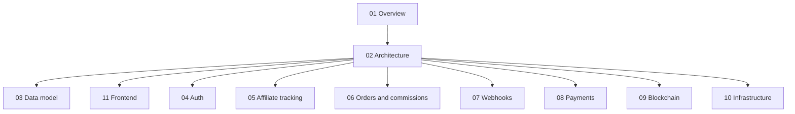

# 01 — Project overview

## Purpose

**AffilFlow** is an **affiliate marketing** platform: a **Go/Fiber API** plus a **Next.js** web app (UI built with **shadcn/ui**). Together they:

- Registers **affiliates** and unique **referral codes**.
- Records **clicks** when shoppers follow referral links.
- Accepts **order events** from e-commerce integrations (Shopify, WooCommerce).
- Computes **commissions**, tracks **payouts**, and optionally **anchors** activity on **Hyperledger Fabric**.
- Exposes a **REST API** (Fiber) secured with **Keycloak** (JWT validation only on the API side).

## In scope — backend

| Area | Description |
|------|-------------|
| HTTP API | Fiber, versioned routes under `/api/v1`, public tracking + webhook endpoints |
| Auth | Keycloak-issued JWTs: validate signature via JWKS, RBAC from realm roles |
| Persistence | PostgreSQL via **pgx** (pooled connections), SQL migrations |
| Integrations | Shopify webhooks (HMAC), WooCommerce webhooks + REST for order fetch |
| Payments | **Platform:** Stripe Billing (€0 / €10 / €20 / €50 tiers, invite limits). **Affiliates:** Stripe Connect + PayPal Payouts API |
| Blockchain | Fabric SDK: record commission/payout events (async + retry) |
| Ops | Centralized errors, structured logging, Docker Compose for local dependencies |

## In scope — frontend

| Area | Description |
|------|-------------|
| Web app | **Next.js** (App Router), consuming the Fiber API |
| UI kit | **shadcn/ui** + Tailwind CSS |
| Identity in browser | OIDC login against **Keycloak**; forward access tokens to the API (see [11-frontend-nextjs-shadcn.md](11-frontend-nextjs-shadcn.md)) |
| Onboarding | Companies **invite affiliates** by **email and/or shareable link** (e.g. Instagram DM); affiliates can **discover programs** and **apply** (see [13-affiliate-onboarding-and-discovery.md](13-affiliate-onboarding-and-discovery.md)) |

## Out of scope (unless added later)

- **Merchant** e-commerce storefront (Shopify/Woo) theming—that lives on the merchant’s platform; we integrate via webhooks/API only.
- Keycloak **administration** UI automation (realm setup documented manually).
- Full chaincode development lifecycle beyond what’s needed to invoke existing contracts.

## Tech stack (authoritative)

| Layer | Choice |
|-------|--------|
| API language | Go |
| HTTP framework (API) | Fiber |
| Database | PostgreSQL, **pgx** / `pgxpool` |
| Migrations | golang-migrate (SQL files) |
| Identity | Keycloak (OIDC); API validates JWT/JWKS; browser uses OIDC against same realm |
| Frontend | **Next.js**, **shadcn/ui**, Tailwind CSS |
| Blockchain | Hyperledger Fabric (Go SDK), Docker dev network |
| Payments | Stripe, PayPal |

## Glossary

| Term | Meaning |
|------|---------|
| Affiliate | User (from Keycloak) who receives commissions for referred sales |
| Referral code | Public slug in URLs, e.g. `/ref/SUMMER2026` |
| Click | HTTP hit on referral link before redirect; stored for attribution |
| Attribution | Binding an order to an affiliate (via cookie/session or explicit mapping rules) |
| Commission | Money owed to an affiliate for a qualifying order |
| Payout | Money movement to affiliate (Stripe/PayPal), reflected in DB + optionally Fabric |

## Documentation map

