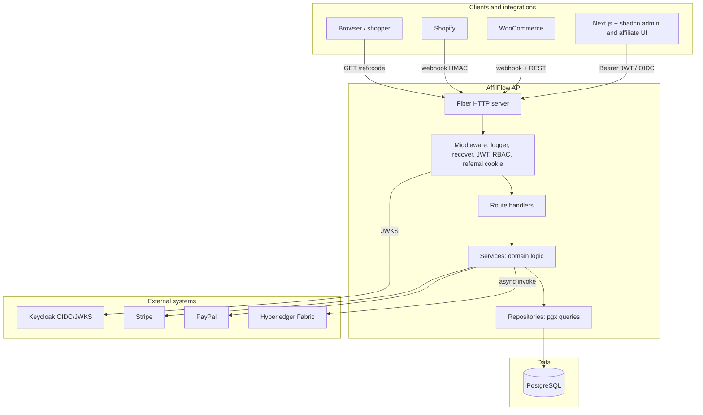
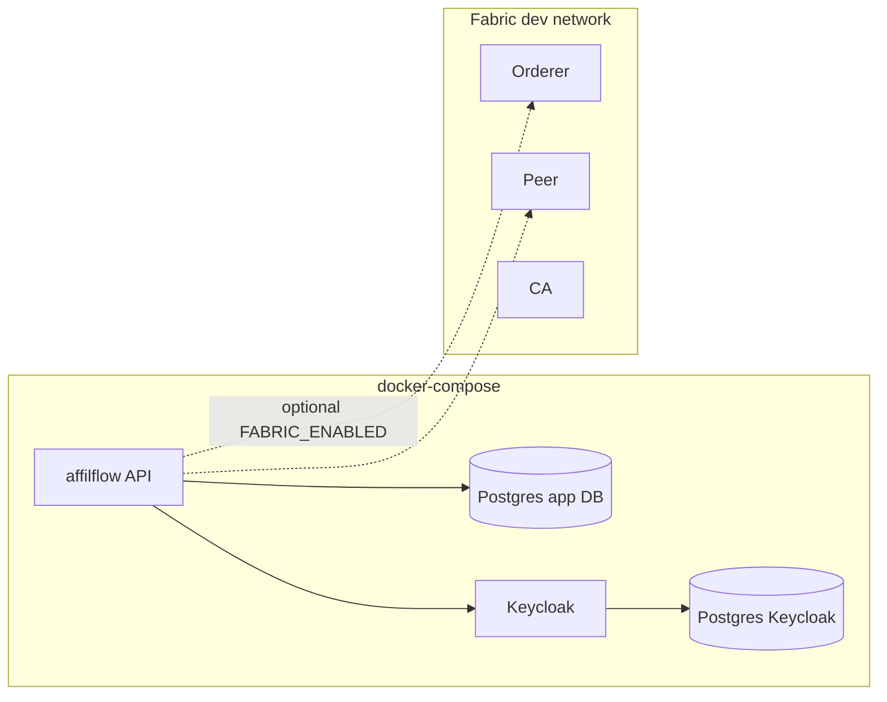

# 02 — System architecture

## Logical layers

## Component responsibilities

| Component | Responsibility |
|-----------|----------------|
| **Handlers** | Parse HTTP, validate input, map errors to JSON; no heavy business rules |
| **Services** | Commissions, orders, webhooks, payouts, blockchain scheduling; transactions |
| **Repositories** | SQL only; return models; support `BeginTx` for atomic multi-table writes |
| **Middleware** | JWT validation, role checks, request logging, panic recovery, referral cookie attachment |
| **pkg/** | Shared HTTP error envelope, retry helper, small utilities |
| **Next.js app** (separate package) | Pages/layouts, shadcn components, Keycloak login UX, calls Fiber `/api/v1` |

## Frontend (see also)

[11-frontend-nextjs-shadcn.md](11-frontend-nextjs-shadcn.md) describes how **Next.js** and **shadcn/ui** obtain tokens from **Keycloak** and call the **Fiber** API, plus CORS/BFF considerations.

## Route groups (conceptual)

| Group | Auth | Examples |
|-------|------|----------|
| Public | None | `GET /ref/:code`, `GET /health` |
| Webhooks | Signature / secret (not Keycloak) | `POST /webhooks/shopify/order-paid`, `POST /webhooks/woocommerce/order-created` |
| API v1 | Keycloak JWT + RBAC | CRUD affiliates, admin payout run, etc. |

Exact paths are finalized in implementation; protected resources live under `/api/v1/...`.

## Deployment view (Docker)

- **Keycloak** and its database run in Compose for local development.
- **Fabric** uses either the official **test-network** (scripted) or an additional Compose file; the API reads TLS paths and connection profile from environment variables.

## Cross-cutting concerns

| Concern | Approach |
|---------|----------|
| Errors | Single Fiber `ErrorHandler`; stable `code` + human-readable `message` |
| Logging | Structured fields: request id, route, status, latency |
| Concurrency | Webhook and blockchain side effects in goroutines with bounded retries |
| Idempotency | Webhook handlers should key on external order id + source to avoid duplicate orders |

## Feature → doc reference

| Feature | Deep dive |
|---------|-----------|
| JWT + roles | [04-authentication-keycloak.md](04-authentication-keycloak.md) |
| Referral clicks | [05-affiliate-tracking.md](05-affiliate-tracking.md) |
| Orders & commissions | [06-orders-commissions.md](06-orders-commissions.md) |
| Shopify / Woo | [07-webhooks-shopify-woocommerce.md](07-webhooks-shopify-woocommerce.md) |
| Payouts | [08-payments-payouts.md](08-payments-payouts.md) |
| Fabric | [09-blockchain-hyperledger-fabric.md](09-blockchain-hyperledger-fabric.md) |
| Env & Compose | [10-infrastructure-docker.md](10-infrastructure-docker.md) |
| Next.js + shadcn | [11-frontend-nextjs-shadcn.md](11-frontend-nextjs-shadcn.md) |
| Platform subscriptions | [12-platform-subscriptions-billing.md](12-platform-subscriptions-billing.md) |
| Invites + directory | [13-affiliate-onboarding-and-discovery.md](13-affiliate-onboarding-and-discovery.md) |
