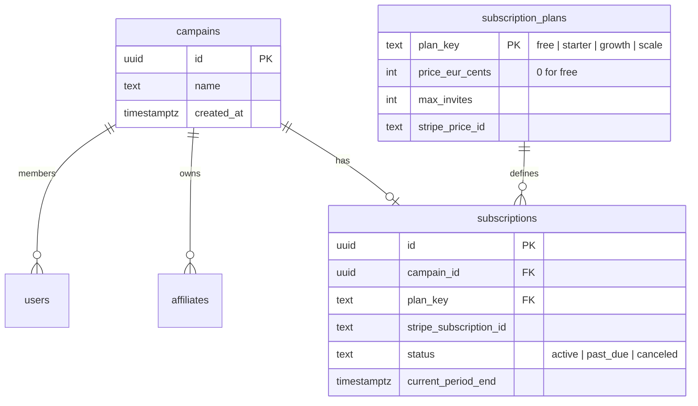
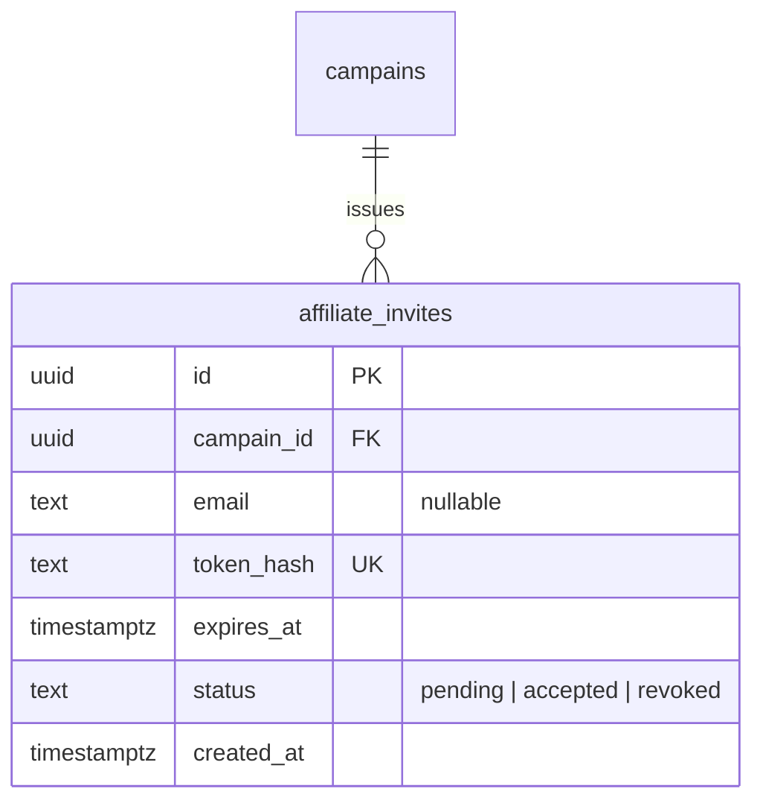
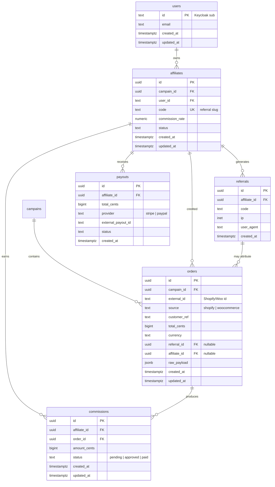

# 03 — Data model

## Multi-tenancy and subscriptions (platform SaaS)

Each **merchant** using AffilFlow belongs to a **campain** with a **subscription** and an **invite cap** (how many affiliates they may onboard). Defaults: **free = 3 invites**; paid **€10 / €20 / €50** per month with higher caps (see [12-platform-subscriptions-billing.md](12-platform-subscriptions-billing.md)).

Affiliate and order rows should be **scoped by `campain_id`** (add FK where missing in implementation).

### Affiliate invites and discovery (see [13](13-affiliate-onboarding-and-discovery.md))

Optional **campain** columns: `slug`, `discovery_enabled`, `approval_mode` for the public directory and apply flows.

## Entity-relationship (affiliate core)

## Table purposes

| Table | Purpose |
|-------|---------|
| **campains** | Paying tenant; subscription and invite limits apply here |
| **subscription_plans** | Plan keys, EUR price, **max_invites**, Stripe price ids |
| **subscriptions** | Active Stripe subscription per campain |
| **users** | Mirror of Keycloak subjects; may belong to a **campain** |
| **affiliates** | Business entity: code, rate, status; links to `users` and **campain** |
| **referrals** | Immutable click stream for analytics and attribution debugging |
| **orders** | Normalized order from any source; `external_id` + `source` uniqueness enforced |
| **commissions** | Monetary obligation per order; drives payout batches |
| **payouts** | Batch or per-affiliate payout records tied to Stripe/PayPal references |

## Key constraints

- **Unique affiliate code** — prevents duplicate public URLs.
- **Unique (external_id, source)** on orders — webhook retries must not create duplicate business rows (use upsert or check-then-insert in a transaction).
- **Commission status** — `pending` → `approved` (optional manual step) → `paid` after successful payout.

## Money representation

- Store amounts as **integer cents** (`bigint`) with an ISO **currency** field on orders to avoid floating-point errors.
