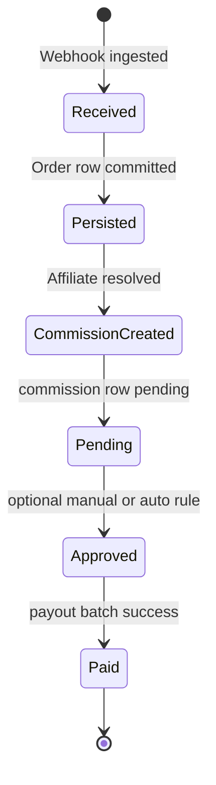
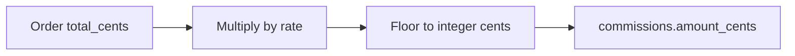

# 06 — Orders and commissions

## Order lifecycle

## Commission calculation

1. Determine **order total** in minor units (cents) and **currency** from the normalized order DTO.
2. Resolve **affiliate** for this order (see webhook doc for attribution rules).
3. Read **commission_rate** from `affiliates` (or fall back to global default from config).
4. **amount_cents** = `floor(total_cents * commission_rate)` when rate is stored as decimal fraction (e.g. `0.10` for 10%), or apply the documented formula if rate is stored as basis points.

## Status semantics

| Status | Meaning |
|--------|---------|
| `pending` | Commission recorded; not yet approved for payout |
| `approved` | Eligible to be included in the next payout run |
| `paid` | Included in a successful payout; amounts settled externally |

Whether `pending` → `approved` is automatic or manual is a **product decision**; the schema supports both.

## Idempotency

- Webhooks may retry. Use **natural key** `(source, external_id)` on **orders** to ensure one business order row per external order.
- **Commissions:** one commission row per order per affiliate; enforce unique `(order_id)` or `(order_id, affiliate_id)` depending on rules.

## Transactions

Create **order** + **commission** in a **single database transaction** when both are new. If order exists, only insert commission if missing.
