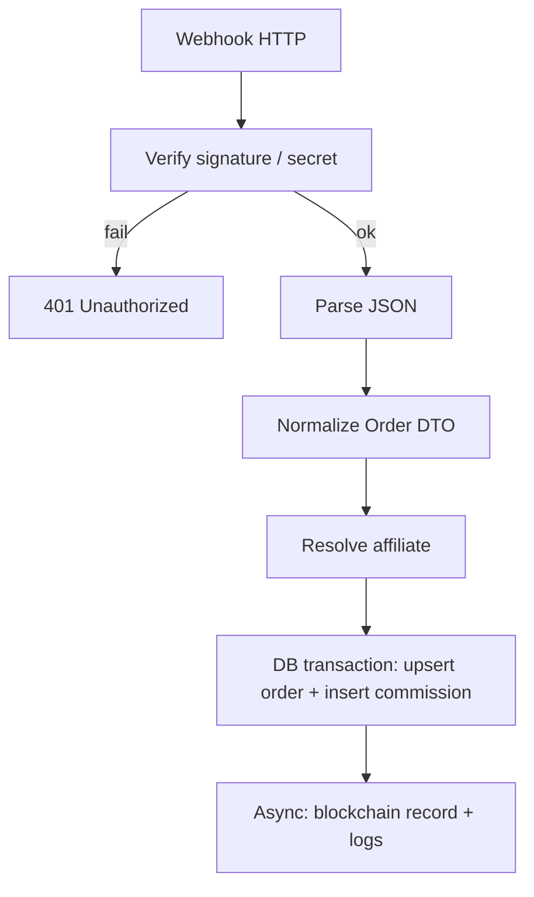

# 07 — Webhooks (Shopify & WooCommerce)

## Shared processing pipeline

Both integrations normalize into an **internal order DTO**, then call the same service method:

**Async:** Blockchain writes and non-critical enrichment run in **goroutines** with **retry**; the HTTP response returns quickly after DB commit (or after validation failure before DB).

## Shopify: `POST /webhooks/shopify/order-paid`

| Step | Detail |
|------|--------|
| Raw body | Read **raw bytes** before JSON unmarshaling (required for HMAC). |
| Header | `X-Shopify-Hmac-Sha256`: HMAC-SHA256 of body with `SHOPIFY_WEBHOOK_SECRET`. |
| Verify | Constant-time compare of base64-decoded digest vs computed HMAC. |
| Extract | `order.id`, `total_price`, currency, customer identifiers, line items as needed. |
| Map | `external_id` = stringified Shopify order id; `source` = `shopify`. |

Reference: [Shopify webhook authentication](https://shopify.dev/docs/apps/build/webhooks/subscribe/https).

## WooCommerce: `POST /webhooks/woocommerce/order-created`

| Step | Detail |
|------|--------|
| Verify | Depends on Woo setup: **secret in query**, **Basic auth**, or **signature header**—implement **one configurable strategy** and document it. |
| Payload | May be partial; if **order total or line items** missing, **GET** full order via Woo REST API using stored credentials (`WOOCOMMERCE_URL`, consumer key/secret). |
| Map | `external_id` = Woo order id; `source` = `woocommerce`. |

## Affiliate resolution (examples)

Implement **one or more** strategies (product choice):

1. **Metafield / custom field** on the order containing `affiliate_id` or `code`.
2. **Coupon code** tied to affiliate in AffilFlow DB.
3. **Cookie** only if the storefront forwards it (rare on server webhooks)—usually not available.

Document the chosen strategy in deployment runbooks.

## Error handling

| Situation | HTTP | Action |
|-----------|------|--------|
| Bad signature | 401 | Log, no DB write |
| Duplicate order | 200 or 204 | Idempotent ack (avoid platform retry storms) |
| Transient DB error | 500 | Platform retries; ensure idempotency |
