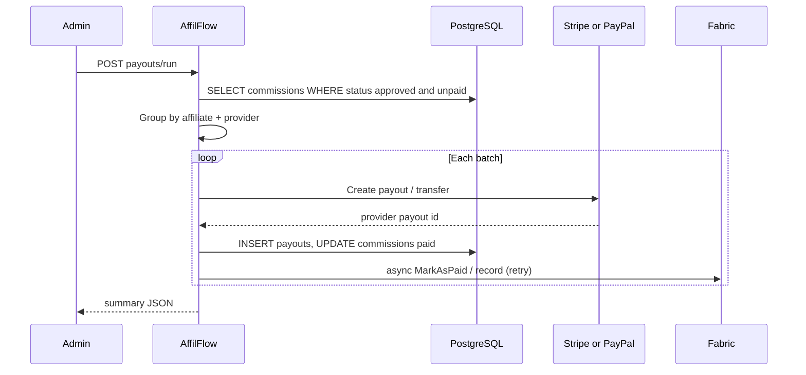

# 08 — Payments and payouts

## Platform vs affiliate money

This document focuses on **paying affiliates** (commissions). **AffilFlow subscription billing** (€0 / €10 / €20 / €50 tiers, invite limits) is documented in [12-platform-subscriptions-billing.md](12-platform-subscriptions-billing.md) and uses **Stripe Billing** separately from **Stripe Connect** payouts below.

## Providers (affiliate payouts)

| Provider | API | Typical use |
|----------|-----|-------------|
| **Stripe** | Payouts / Transfers; **Stripe Connect** for connected accounts | Marketplace-style payouts to affiliates |
| **PayPal** | **Payouts API** | Batch send to PayPal emails or merchant references |

Exact Stripe objects (`Transfer`, `Payout`, Connect **destination** accounts) depend on whether affiliates are **Stripe Connect** recipients; configuration must match legal and onboarding flow.

## Payout run endpoint (conceptual)

`POST /api/v1/payouts/run` (protected, **admin** role):

## Data updates

1. Insert **payouts** row with `external_payout_id`, `provider`, `status`.
2. Update **commissions** to `paid` only after provider confirms success (or use two-phase: `processing` then `paid` if needed).
3. Trigger **Fabric** `MarkAsPaid` (or equivalent) **asynchronously** with retries.

## Failure handling

| Failure | Behavior |
|---------|----------|
| Provider API timeout | Retry with backoff; do not mark `paid` |
| Partial batch failure | Log per-affiliate errors; leave unpaid commissions for next run |
| Reconciliation | Store provider ids for support and auditing |

## Secrets (environment)

| Variable | Purpose |
|----------|---------|
| `STRIPE_SECRET_KEY` | Server-side Stripe API |
| `STRIPE_CONNECT_*` or account ids | If using Connect |
| `PAYPAL_CLIENT_ID`, `PAYPAL_CLIENT_SECRET`, mode | PayPal OAuth + Payouts |
