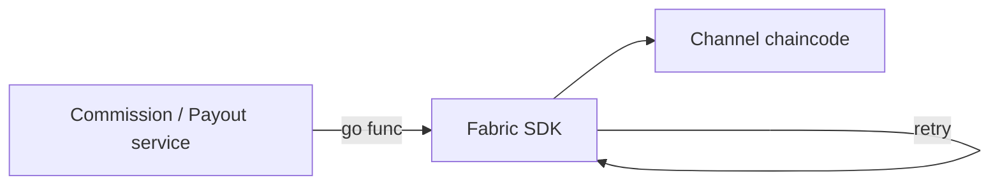

# 09 — Blockchain (Hyperledger Fabric)

## Role in AffilFlow

Fabric provides an **append-only, tamper-evident log** of commission-related events for audit and cross-org trust. It is **not** the system of record for balances; **PostgreSQL** remains authoritative for money and status.

## Service interface (conceptual)

| Method | Purpose |
|--------|---------|
| `RecordTransaction(order_id, affiliate_id, commission, status)` | Write a chaincode event when commission is created or updated |
| `MarkAsPaid(order_id)` | Record settlement after payout |

Invocations run in **goroutines** with **retry** (transient failures); failures are logged and can be alertable.

## Configuration

Typical environment variables:

| Variable | Purpose |
|----------|---------|
| `FABRIC_ENABLED` | `true` to use real SDK; `false` for no-op in dev/CI |
| `FABRIC_NETWORK_CONFIG` | Path to connection profile (YAML/JSON) |
| `FABRIC_CHANNEL`, `FABRIC_CHAINCODE` | Target channel and chaincode name |
| `FABRIC_USER`, MSP paths | Identity for signing proposals |

Paths often point to crypto material generated by the **Fabric test-network** or custom Compose.

## Local development

- Bring up a **Docker-based** Fabric network (see [10-infrastructure-docker.md](10-infrastructure-docker.md)).
- **Install/instantiate** chaincode that exposes functions matching `RecordTransaction` / `MarkAsPaid` (or a single generic `PutEvent` with JSON payload).
- Point AffilFlow at the generated **connection profile** and TLS certs.

## Failure modes

| Situation | Behavior |
|-----------|----------|
| Fabric down | Retries exhaust; DB still committed; ops investigates logs |
| Chaincode error | Log response payload; do not roll back DB payout if already paid externally—use compensating admin tools |
