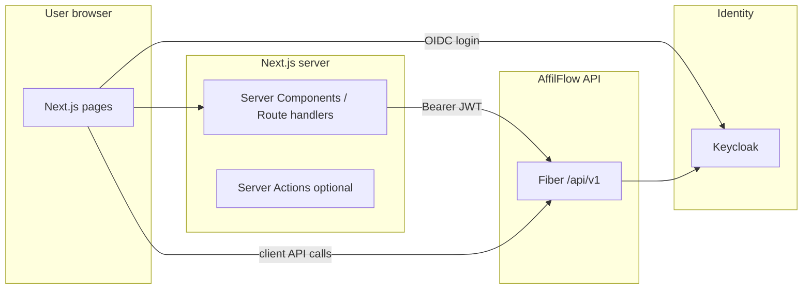

# 11 — Frontend (Next.js + shadcn/ui)

## Role

The **web application** provides dashboards and workflows for **admins** and **affiliates** (and optional internal tools). It is a **separate codebase** from the Go API (typical layout: monorepo folder `web/` or `apps/web/`, or a sibling repository).

| Concern | Owner |
|---------|--------|
| UI, routing, forms, tables | **Next.js** app |
| Design system (accessible primitives, theming) | **shadcn/ui** (Radix UI + Tailwind CSS) |
| Business rules, persistence, webhooks | **AffilFlow API** (Fiber) |

## Stack

| Piece | Choice | Notes |
|-------|--------|--------|
| Framework | **Next.js** (App Router recommended) | Server Components where appropriate; Client Components for interactive shadcn widgets |
| Styling | **Tailwind CSS** | Required by shadcn/ui |
| Components | **shadcn/ui** | Copy-paste components into `components/ui/`; full ownership of code |
| Data fetching | Server: `fetch` to API; Client: TanStack Query optional | Send `Authorization: Bearer` for protected routes |
| Auth (browser) | OIDC with **Keycloak** | Use a maintained pattern (e.g. NextAuth.js / Auth.js Keycloak provider, or dedicated OIDC client with PKCE); tokens obtained in the browser or server session, then forwarded to Fiber |

## High-level architecture

- **Keycloak** issues tokens after user login; the frontend **never** stores API secrets—only user tokens (prefer **httpOnly** cookies via BFF pattern, or secure client storage depending on chosen auth library).
- **Fiber** continues to validate JWTs via **JWKS** (see [04-authentication-keycloak.md](04-authentication-keycloak.md)); the frontend’s job is to obtain and attach those tokens to API calls.

## Suggested app surfaces

| Area | Purpose | API usage |
|------|---------|-----------|
| **Admin** | Run payouts, manage affiliates, view orders/commissions | `/api/v1/...` with `admin` realm role |
| **Affiliate portal** | View own stats, referral link, commission history | `/api/v1/...` with `affiliate` (or scoped) role |
| **Public** | Marketing pages (optional); referral entry usually hits **Fiber** `GET /ref/:code` directly or via redirect | Public or static |

Exact routes and RBAC mapping are defined when the OpenAPI/route list is added.

## shadcn/ui conventions

- Initialize with the [shadcn CLI](https://ui.shadcn.com/) in the Next.js project (`npx shadcn@latest init`).
- Add components as needed (`button`, `table`, `dialog`, `form`, `data-table`, etc.).
- Use **Tailwind** design tokens and **CSS variables** for light/dark mode if required.

## CORS and origins

- In production, configure Fiber (or a reverse proxy) to allow the **Next.js origin** for browser `fetch` calls if the frontend calls the API cross-origin.
- Alternatively, route browser traffic through **same-origin** Next.js **rewrites** to the API (BFF-style) to reduce CORS surface.

## Local development

| Service | Typical URL |
|---------|-------------|
| Next.js dev server | `http://localhost:3001` (default in `web/package.json`; avoids port 3000 / Grafana) |
| Fiber API | `http://localhost:8080` (example) |
| Keycloak | `http://localhost:8180` (example) |

Document exact ports in the root README when Compose files are added.

## Relationship to backend docs

| Topic | Backend doc |
|-------|----------------|
| JWT claims, roles | [04-authentication-keycloak.md](04-authentication-keycloak.md) |
| Error JSON shape | Align UI to Fiber centralized error format |
| Infrastructure | [10-infrastructure-docker.md](10-infrastructure-docker.md) |

## Out of scope for this doc

- Pixel-perfect mockups and full page list (add when UI is implemented).
- Keycloak realm JSON import (optional automation in infra docs).
