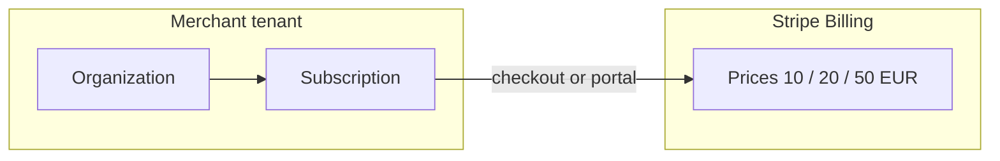

# 12 — Platform subscriptions (AffilFlow SaaS revenue)

This document describes how **AffilFlow charges merchants** who use the platform. It is **separate** from **affiliate payouts** (Stripe Connect / PayPal to affiliates)—see [08-payments-payouts.md](08-payments-payouts.md).

## Two payment domains

| Domain | Who pays | Who receives | Mechanism |
|--------|----------|--------------|-----------|
| **Platform subscription** | Merchant (tenant) | AffilFlow (you) | **Stripe Billing** (subscriptions) or equivalent |
| **Affiliate commissions** | Merchant (from settled orders) | Affiliates | Stripe Connect / PayPal Payouts |

Use **different Stripe objects** and ideally **separate Stripe “modes” or metadata** so subscription charges are never confused with Connect transfers.

## Invite limit (product lever)

An **invite** is the right for a tenant to **onboard one affiliate** (or one seat—align naming in UI) on AffilFlow. Each subscription tier caps **active or total invites** per billing period (implementation choice: hard cap vs monthly reset).

**How invites are sent and accepted** (email, shareable link for Instagram DMs, directory for affiliates to find companies) is specified in [13-affiliate-onboarding-and-discovery.md](13-affiliate-onboarding-and-discovery.md).

Default **tier definition** (amounts in **EUR** per month; **invite counts are configurable** in `subscription_plans`, not hard-coded in app logic):

| Plan key | Price | Max invites (default) |
|----------|-------|------------------------|
| `free` | €0 | **3** |
| `starter` | **€10** | **20** |
| `growth` | **€20** | **60** |
| `scale` | **€50** | **200** |

You can **adjust** `max_invites` per row when product marketing changes, without redeploying (if loaded from DB).

## Lifecycle

1. Merchant signs up → default **`free`** plan (3 invites).
2. Upgrade via **Stripe Checkout** or **Customer Portal** to `starter` / `growth` / `scale`.
3. Webhooks (`customer.subscription.updated`, etc.) update `subscriptions` in Postgres.
4. **Invite affiliate** endpoint checks `current_invites < max_invites` for the tenant’s plan.

## Enforcement

| Action | Rule |
|--------|------|
| Create / invite affiliate | Deny with `402` or `403` + stable error code if at cap |
| Downgrade | Options: grandfather invites, or block new invites until under new cap (document policy) |

## Keycloak / users

Tenants may map to **Keycloak groups** or **organization claims**; alternatively store `organization_id` on app users and resolve plan server-side.

## Environment (conceptual)

| Variable | Purpose |
|----------|---------|
| `STRIPE_BILLING_SECRET_KEY` | API key used only for **Billing** (can equal `STRIPE_SECRET_KEY` if one account, separate webhook secret recommended) |
| `STRIPE_BILLING_WEBHOOK_SECRET` | Verify `checkout.session.completed`, subscription events |

## Frontend

Next.js: **pricing page**, **billing portal** link, and display **invites used / remaining** (shadcn cards, see [11-frontend-nextjs-shadcn.md](11-frontend-nextjs-shadcn.md)).
