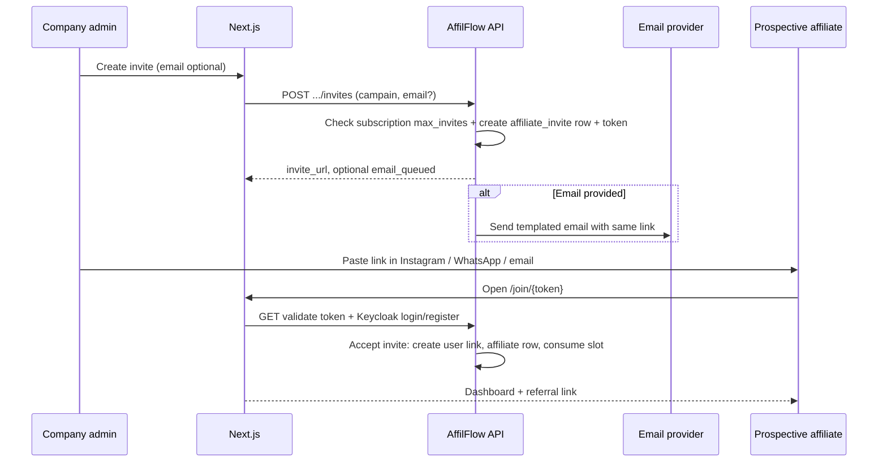
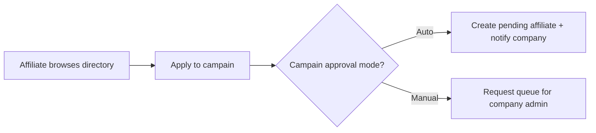

# 13 — Affiliate onboarding and discovery

This document ties together **how companies onboard affiliates** (email + shareable link—e.g. Instagram DM) and **how affiliates find companies** to promote. It complements **invite limits** in [12-platform-subscriptions-billing.md](12-platform-subscriptions-billing.md).

## Roles

| Role | In AffilFlow |
|------|----------------|
| **Company (merchant)** | `campain` with a subscription; runs the affiliate program |
| **Affiliate** | `user` + `affiliate` row under one or more campains (usually one primary program per relationship) |

## Path A — Company invites someone they found (e.g. Instagram)

Typical story: the company DMs a creator and wants them in the program. The company needs **either** an **email invite** **or** a **single link** they can paste into chat.

### Flow

### Delivery channels

| Channel | Implementation |
|---------|------------------|
| **Shareable link** | HTTPS URL: `{APP_BASE_URL}/join/{token}` (or `/invite/{token}`). Token is **unguessable**, **single-use** or **expiring** (configurable TTL, e.g. 14 days). Works in Instagram DMs, Telegram, SMS copy-paste. |
| **Email** | Same URL inside the body; optional **Resend / SES / SendGrid** (env: API key, from-address). If email fails, link still works if merchant copies it. |
| **No email required** | Merchant can create invite **link-only** for influencers they only reach via social DMs. |

### Billing rule (slots)

- Creating a **pending** invite may **reserve** a slot, or only **accepted** affiliates count—**pick one policy** and enforce consistently (recommended: **count accepted affiliates + optionally cap concurrent pending** to prevent abuse).

See [12-platform-subscriptions-billing.md](12-platform-subscriptions-billing.md) for `max_invites`.

## Path B — Affiliates discover companies and start selling

Affiliates need a way to **find programs** without a prior DM.

### Options (can combine)

| Mechanism | Description |
|-----------|-------------|
| **Public program directory** | Next.js page lists **campains** that opted into **public discovery** (`discovery_enabled`, blurb, logo, vertical). Affiliate clicks **Apply** → request or auto-invite flow. |
| **Search** | Filter by category, country, commission range (denormalized fields for performance). |
| **Direct link** | Company shares a **public landing** `/{campainSlug}/affiliate-program` with CTA “Apply”. |

### Apply flow

Approval mode is per **campain** setting: **open**, **request-to-join**, or **invite-only**.

## Data model additions (conceptual)

| Table / entity | Purpose |
|----------------|---------|
| **affiliate_invites** | `id`, `campain_id`, `email` (nullable), `token_hash`, `expires_at`, `status` (`pending` / `accepted` / `revoked`), `created_by_user_id` |
| **campain** fields | `slug` (public URL), `discovery_enabled`, `approval_mode` |

On **accept**: create **`affiliates`** row (and `users` if new), mark invite **accepted**, bind **Keycloak** user to campain (group or `campain_id` claim).

## API surface (conceptual)

| Endpoint | Purpose |
|----------|---------|
| `POST /api/v1/campains/{id}/invites` | Company admin creates invite; returns **link**; optional send email |
| `GET /join/{token}` (web) | Next.js page; validates token via public API |
| `POST /api/v1/invites/{token}/accept` | After Keycloak session established, completes onboarding |
| `GET /api/v1/directory/programs` | Public or authenticated list of discoverable campains |
| `POST /api/v1/directory/programs/{id}/apply` | Affiliate applies |

Exact paths version under `/api/v1` as usual.

## Frontend (Next.js + shadcn)

- **Company:** “Invite affiliate” dialog—email optional, **Copy link** button prominent (for Instagram).
- **Affiliate:** **Directory**, **program page**, **Apply**, **Accept invite** landing with login.

## Security

- Tokens: **high entropy**, store **hash only** in DB if possible; rate-limit validation attempts.
- Scoped to **one campain**; no cross-tenant token reuse.
